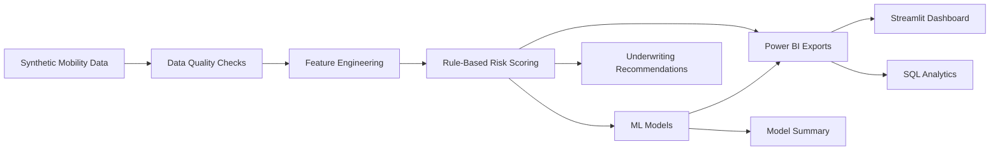
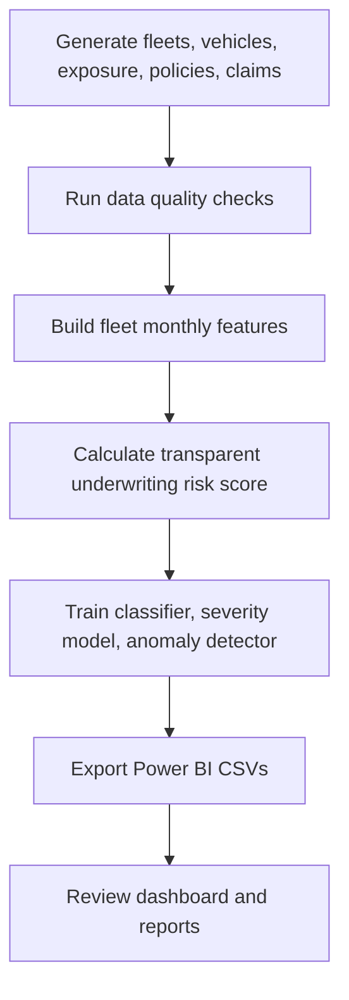

# Mobility Risk AI


## Executive Summary

Mobility Risk AI is a production-style commercial insurance analytics prototype for autonomous, rideshare, delivery, logistics, and mixed mobility fleets.

Traditional commercial auto underwriting relies heavily on human driver risk. Autonomous and mobility fleets shift that risk toward software reliability, sensor performance, route complexity, operating environment, utilization intensity, intervention frequency, maintenance controls, claims severity, and portfolio concentration.

This project answers: how should underwriting and portfolio teams evaluate mobility risk when the human driver is no longer the only risk center?

## Business Problem

Commercial insurers need better analytics for fleets where risk is driven by vehicle autonomy, sensor stacks, operational design domains, high-mileage usage, urban complexity, weather exposure, software updates, claims patterns, and client safety controls.

The platform supports:

- Underwriting triage and renewal review
- Pricing adequacy discussions
- Portfolio risk monitoring
- Claims and exposure analysis
- Rideshare/autonomous client conversations
- Power BI-ready executive reporting

## Why Autonomous Mobility Changes Insurance Risk

Autonomous and rideshare mobility changes the rating conversation from only "who is driving?" to:

- How often does the system disengage?
- Are manual overrides increasing?
- Are sensors failing in certain geographies?
- Are high-complexity routes producing losses?
- Is software stability improving or degrading?
- Are claim frequency and severity aligned with premium?
- Which accounts need underwriting action?

## Architecture



## Workflow



## Data Model

The project generates synthetic data only:

- `fleets.csv`: account profile, client type, region, autonomy level, safety and maintenance scores.
- `vehicles.csv`: vehicle-level autonomy, sensor, software, utilization, and maintenance attributes.
- `exposure.csv`: 24 months of vehicle exposure, miles, overrides, disengagements, near misses, weather, route, and sensor metrics.
- `policies.csv`: policy terms, limits, deductibles, written/earned premium, pricing score, renewal status.
- `claims.csv`: claim losses, reserves, litigation, injury/property flags, software/sensor indicators, and severity.
- `client_interactions.csv`: QBR, renewal, underwriting, claims, and ad hoc account interactions.

## Risk Dimensions

- Loss ratio
- Claim frequency and severity
- Manual override rate
- Disengagement rate
- Near-miss and emergency braking rates
- Sensor failure rate
- Weather, congestion, route, pedestrian, and construction exposure
- Maintenance and safety program quality
- Autonomy level and autonomous mile mix

## Python Pipeline

Core modules:

- `src/data_generation.py`: creates internally consistent synthetic insurance datasets.
- `src/data_quality.py`: validates key insurance, claims, exposure, and autonomy assumptions.
- `src/feature_engineering.py`: creates fleet-month risk features and portfolio summaries.
- `src/risk_scoring.py`: creates transparent underwriting risk scores and recommendations.
- `src/ml_models.py`: trains classifier, severity regressor, and anomaly detector.
- `src/reporting.py`: exports Power BI-ready CSVs and business reports.

## Machine Learning Approach

ML is not replacing underwriting judgment. It is AI-assisted underwriting intelligence for human decision support.

Models:

- Risk tier classifier using `RandomForestClassifier`
- Claim severity regressor using `RandomForestRegressor`
- Anomaly detection using `IsolationForest`

Outputs:

- `outputs/model_artifacts/risk_classifier.pkl`
- `outputs/model_artifacts/severity_model.pkl`
- `data/processed/ml_feature_importance.csv`
- `data/processed/anomaly_results.csv`
- `reports/model_summary.md`

## SQL Analytics

The `sql/` folder demonstrates business and technical SQL:

- Table creation
- Data quality checks
- Portfolio analysis
- Underwriting views
- Claims and exposure analysis

## Power BI-Ready Outputs

CSV exports are written to `data/powerbi_exports/`:

- `portfolio_dashboard.csv`
- `underwriting_account_summary.csv`
- `claims_dashboard.csv`
- `exposure_dashboard.csv`
- `ml_risk_scores.csv`
- `anomaly_alerts.csv`
- `client_interaction_summary.csv`

See `reports/powerbi_dashboard_spec.md` for dashboard layout guidance.

## Business Outcomes

This project shows how analytics can help commercial insurance teams:

- Identify high-risk fleets and accounts
- Explain risk drivers behind claim frequency and severity
- Prioritize pricing and renewal review queues
- Monitor autonomous mobility operations
- Support client conversations with evidence
- Give executives a portfolio-level risk view

## Screenshots

Placeholder ideas:

- Executive Portfolio dashboard
- Underwriting Intelligence risk table
- Autonomous Risk trends
- Claims & Exposure severity view
- ML feature importance chart
- Data Quality findings

## How To Run

```bash
python -m venv .venv
source .venv/bin/activate
pip install -r requirements.txt
python -m src.data_generation
python -m src.data_quality
python -m src.feature_engineering
python -m src.risk_scoring
python -m src.ml_models
python -m src.reporting
streamlit run app.py
pytest
```

## Limitations

- Synthetic data only
- No real insurer, fleet, policy, claims, or customer data
- Rule-based risk score is explainable but simplified
- ML models are demonstration baselines, not production actuarial models
- No live telematics feed or external vendor integration
- No regulatory filing or actuarial pricing indication

## Future Enhancements

- Add geospatial exposure maps
- Add credibility weighting and actuarial indications
- Add claims reserving triangles
- Add PostgreSQL deployment option
- Add Power BI `.pbix` template
- Add model monitoring and drift detection
- Add scenario analysis for new autonomous programs
- Add API endpoints for account-level risk lookup
